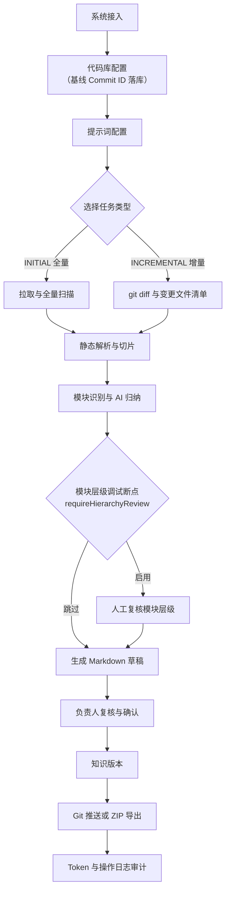

# CLAUDE.md

This file provides guidance to Claude Code (claude.ai/code) when working with code in this repository.

## 项目概述

代码洞察平台（CodeInsight Platform）将代码库转化为可维护、可追溯、可复核的知识资产。
**核心流程**：代码拉取 → Java 静态解析 → 代码切片 → AI 归纳 → 草稿复核 → 知识版本 → Git/ZIP 输出 → Token/操作日志。
**关键约束**：AI 内容必须经人工复核后才能进入正式知识库，绝不直接推送到 Git。

详细业务背景、当前 MVP 进度与已知限制见 [README.md](./README.md)。

## 技术栈

- **后端**：Java 17 + Spring Boot 3.3 + MyBatis Plus + PostgreSQL + Redis + JGit
- **前端**：React 19 + TypeScript + Vite + Ant Design + Zustand + ECharts + Monaco Editor + Hash Router
- **存储分工**：PostgreSQL（状态/元数据）｜本地/对象存储（正文）｜Redis（草稿实时编辑与锁）｜Git（已确认知识）

## 项目级 AI Skills

前端页面开发相关 skill 放在 `.codex/skills/`。涉及前端页面、路由、请求、状态、图表、编辑器或 AI 交互时，优先查看对应 `SKILL.md`：

- `codeinsight-frontend-conventions`
- `antd-token-admin-ui`
- `react-router-layout-routes`
- `axios-query-server-state`
- `zustand-client-state-boundaries`
- `ant-design-pro-crud-patterns`
- `monaco-review-editor`
- `echarts-admin-analytics`
- `antd-x-ai-workflows`
- `motion-admin-microinteractions`

## 常用命令

```bash
# 前端
cd frontend
npm install
npm run dev        # http://localhost:5173（默认把 /api 代理到 localhost:8080）
npm run lint       # eslint .
npm run build      # tsc -b + vite build

# 后端
cd backend
mvn spring-boot:run                          # http://localhost:8080/api
mvn -DskipTests compile                      # 仅编译（沙盒无 PG 时可用）
mvn test-compile                             # 含测试代码编译
mvn clean test                               # 全量测试（当前 27 个测试类，JUnit 5，需本地 PG + Redis 可达）
mvn -Dtest=ClassNameTest test                # 跑单个测试类
mvn -Dtest=ClassNameTest#methodName test     # 跑单个测试方法
mvn -DskipTests clean package                # 打包 JAR

# Swagger UI
# http://localhost:8080/api/swagger-ui.html
```

后端默认 `LLM_MOCK=true`，无需真实 API Key；切到真实模型时设置 `LLM_API_KEY` 并把 `LLM_MOCK` 置为 `false`。所有可用变量见根目录 `.env.example`。

## 架构要点

### 业务闭环



### 后端模块分层

`backend/src/main/java/com/company/codeinsight/`
- `common/` — config / exception / response / model（共享基础设施）
- `modules/<domain>/` — 每个领域模块统一使用 `entity/`、`mapper/`、`service/`（接口）、`service/impl/`、`controller/` 四层。

当前领域模块清单（共 16 个）：`system`、`repository`、`prompt`、`task`、`scanner`、`parser`、`callchain`、`chunk`、`entrypoint`、`hierarchy`、`ai`、`draft`、`knowledge`、`model`、`auth`、`token`、`log`。模块清单直接看 `modules/` 目录。

任务状态机实现在 `modules/task/`，跨阶段推进由 `TaskStateMachineService` 负责；任何状态变更都需在 `ci_operation_log` 留痕。

### 前端 API 对齐

`frontend/src/api/` 每个文件与后端一个领域模块一一对应（如 `api/task.ts` ↔ `modules/task/`）。所有请求经过 `api/request.ts` 拦截器自动解包后端统一响应：

```json
{ "code": 0, "message": "success", "data": { ... } }
```

页面代码拿到的就是 `data` 内容，code 非零时拦截器会按 `message` 抛错。

### 任务状态机

```
DRAFT
  └─> PENDING
        └─> PULLING_CODE
              └─> PARSING_CODE
                    └─> SPLITTING_TASK
                          └─> AI_ANALYZING
                                ├─> MODULE_HIERARCHY
                                │     └─> MODULE_HIERARCHY_REVIEW (requireHierarchyReview=true 时的断点)
                                │           └─> GENERATING_DOC
                                └─> GENERATING_DOC (requireHierarchyReview=false 时跳过复核断点)
                                      └─> PENDING_REVIEW
                                            └─> REVIEWING
                                                  └─> CONFIRMED
                                                        └─> PUSHING
                                                              └─> PUSHED
```

终止状态：`FAILED` / `CANCELLED` / `ARCHIVED`。`PUSHED` 为终态。状态机禁止非法跳转。`ci_task.require_hierarchy_review` 默认 `true`；关闭后 `MODULE_HIERARCHY` 直接进入 `GENERATING_DOC`，跳过人工断点。

### 增量扫描（INCREMENTAL 任务）

`ci_task.type = INCREMENTAL` 时，流水线按 `git diff <repo.lastCommit>..HEAD` 识别变更/删除文件。核心类型在 `modules/scanner/model/`：

- `IncrementalContext` — 不可变上下文，封装 `changedPaths` / `deletedPaths`，提供 `isPathChanged/Deleted/Unchanged` 判定方法。`IncrementalContext.fullScan()` 走全量分支。
- `ScanResult` — `pullAndScan` 的返回值：`projectDir + IncrementalContext`。

下游 5 个阶段的增量语义：

| 阶段 | 接口重载 | 增量行为 |
| --- | --- | --- |
| `scanner.pullAndScan` | — | `git diff` 算 changed/deleted；仅重写变更文件 snapshot；删被删文件 snapshot；刷新 `repo.lastCommitId` |
| `callchain.persistAstForTask` | `(taskId, projectDir, ctx)` | 删变更 + 删除文件的旧调用链；仅对 changedPaths 中 .java 重解析 |
| `chunk.chunkAndEstimate` | `(taskId, snapshots, ctx)` | 删变更 + 删除文件的旧 chunk；仅对 changedPaths 重建 FILE/CLASS/METHOD |
| `hierarchy.buildAndPersist` | `(taskId, projectDir, ctx)` | 跳过未变入口的 AI；按 Maven 路径推 FQ 类名从 `function.classPaths` 移除被删引用；落表仍走 `deleteByTaskId + 全量 insert` |
| `ai.generateDraftDocument` | `(taskId, chunks, promptContent, ctx)` | 仅对「function.classPaths 命中变更 FQ」的模块重跑 AI；其余模块旧草稿保留 |

降级路径（不会让流水线挂在增量分支）：无 `lastCommitId` 基线 / 本地路径 / Mock 降级 / `resolve(ref^{tree})` 失败（force-push / rebase）→ 警告日志 + 全量扫描。

### 存储边界（不要把正文塞进数据库）

- **PostgreSQL** 只存元数据：`ci_draft_workspace`、`ci_knowledge_draft`、`ci_knowledge_version` 等表的正文字段是 URI/Hash，不是 Markdown 文本本身。
- **文件系统**（默认 `STORAGE_LOCAL_PATH=./storage`）存草稿和知识的正文。
- **Redis** 存草稿的实时编辑（自动保存）和编辑锁。
- **Git** 存已确认的知识。推送时写到目标仓库的 `/docs/code-insight/` 目录，附带 `knowledge-version.json`、`module-map.yaml`、`prompt-used.json`。

## 关键约定

- **数据库 schema 启动时自动初始化**：`spring.sql.init.mode: always` + `backend/src/main/resources/db/schema.sql`。项目未引入 Flyway/Liquibase，修改表结构直接改 SQL 文件；新列用 `ALTER TABLE ... ADD COLUMN IF NOT EXISTS`，保持幂等。
- **数据源 URL 必须带 `stringtype=unspecified`**（PostgreSQL JDBC 兼容要求），改 `application-local.properties` 时不要删这个参数。
- **本地环境特定配置**：PostgreSQL 数据库及 Redis 缓存连接配置独立存放于 `backend/src/main/resources/application-local.properties`。该文件仅供本地开发使用，且包含敏感连接凭证，切勿提交至 Git 仓库。
- **前端用 Hash Router**（`createHashRouter`），不要改成 `BrowserRouter`。
- **Ant Design 主题统一在 `App.tsx` 的 `ConfigProvider` 中配**，新增组件用主题 Token，禁止硬编码颜色值。
- **`SecurityConfig` 当前 `anyRequest().permitAll()`**——MVP 联调专用；前端 `useAuthStore` + `RequireAuth` 仅做 UI 级守卫，后端不参与鉴权。生产前必须替换为正式认证。
- **AI 内容不直接入库到正式知识**——`ci_knowledge_draft` 是草稿表，必须经 `CONFIRMED` 状态才会触发 `knowledge` 模块写出；`MODULE_HIERARCHY_REVIEW` 是模块层级的人工断点，跳过它需要在创建任务时显式传 `requireHierarchyReview=false`。
- **`auth` 模块当前为配置化占位**（`AuthService` 不依赖外部 UM/SSO，账号写在 `application-local.yml` 里），生产前必须接入真实身份源。
- **`.env` 不入库**，模板在 `.env.example`（根目录汇总所有变量，`frontend/.env.example` 仅前端）；真实密钥走环境变量。

## 测试与构建注意

- 后端测试用真实 PostgreSQL/Redis（`application-test.yml`），不是 H2/mock；运行前确保本地服务可用。沙盒环境若无 PG，`mvn test` 会因 DataSource 初始化失败而无法跑通；可改用 `mvn -DskipTests compile` 或 `mvn test-compile` 验证编译。
- 前端主包超 500 kB 时 Vite 会报 chunk-size warning，目前是已知问题（README "已知限制"），不是错误。
- Windows 下若 `mvn clean package` 失败，先停掉运行中的后端进程（旧 JAR 被锁）。
- Git 全局代理 `http://127.0.0.1:7892` 配置存在但常未运行；直连失败时用 `git -c http.proxy= -c https.proxy= <cmd>` 绕过。

## 仓库

- 本地：`C:\project\codeInsight\CodeInsightPlatform`
- Gitee 镜像：`https://gitee.com/kirvos/codeinsight.git`（已配置为 `origin`，默认分支 `main`）
