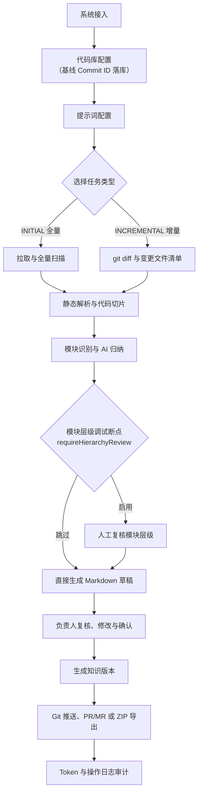

# 代码洞察平台（CodeInsight Platform）

代码洞察平台面向研发团队，将现有代码库持续转化为可维护、可追溯、可复核的代码知识资产。平台串联代码拉取、Java 静态解析、代码切片、AI 归纳、草稿复核、知识版本、Git/ZIP 输出、Token 审计和操作日志，确保 AI 内容先审后发，不直接进入正式知识库。

- 前端：React 19 + TypeScript + Vite + Ant Design + Zustand + ECharts + Monaco Editor + Hash Router
- 后端：Java 17 + Spring Boot 3.3 + MyBatis Plus + PostgreSQL + Redis + JGit
- 存储边界：数据库保存状态和元数据，本地存储/对象存储保存正文，Redis 保存临时编辑与锁，Git 保存已确认知识

## 当前状态与验证

第一阶段 MVP 任务清单已完成，覆盖系统、仓库、提示词、任务、扫描解析、切片、AI/Mock AI、草稿、知识版本、推送、Token 与日志模块。第二阶段已完成登录认证（UM 账号 + 平安令牌）、系统/代码库软删除与聚合指标、模块层级人工复核断点，以及基于 Git Diff 的增量扫描链路。最新前端视觉方案已完成桌面端、移动端、弹窗和导航状态对照验收。

截至 2026-06-28 的可复现验证结果：

| 验证项 | 结果 | 说明 |
| --- | --- | --- |
| `npm run lint` | 通过 | ESLint 无错误 |
| `npm run build` | 通过 | Vite 构建成功；存在主包超过 500 kB 的非阻断告警 |
| `java -version` | 通过 | Java 17 |
| `mvn -DskipTests compile` | 通过 | 后端 16 个模块全部编译通过 |
| `mvn test-compile` | 通过 | 27 个测试类全部编译通过 |
| `mvn test` | 受限 | 需本地 PostgreSQL + Redis 可达（沙盒环境无 PG，扫描器单测启动时会因 DataSource 失败） |
| `mvn clean package` | 受限 | 运行中的后端 JAR 被 Windows 锁定时 `clean` 无法删除旧产物，需先停服 |

这里的"完成"指 MVP 功能和本地验收基线完成，并不等于生产环境开箱即用。生产部署前仍需补齐正式身份认证与授权、密钥托管、真实模型服务、远程 Git 权限、基础设施运维配置和前端代码分包。

## 核心业务闭环



AI 只负责归纳和建议。模块 ID、类路径绑定、Schema 校验、状态推进、存储、版本与推送校验由程序负责；正式知识必须经过负责人确认。

## 核心能力

- **工作台**：任务吞吐、待复核、Token 成本、知识覆盖率、异常提醒与最近推送。
- **登录与会话**：UM 账号 + 平安令牌 6 位独立输入框登录；Zustand 持久化会话 + 路由守卫；当前为占位实现，待 UM/SSO 真实接入。
- **系统与仓库**：系统负责人、启停、软删除、仓库分支、扫描范围、排除规则、入口扫描规则与 Commit 基线。
- **代码库聚合指标**：列表一次性返回代码库数 / 知识版本数 / 最近扫描时间，单条 SQL 避免 N+1。
- **提示词**：模板、版本、复制、启停、变量替换、试跑，按 `MODULARIZE` / `DOCUMENT_GENERATION` 分类。
- **任务引擎**：初始化 / 增量任务、状态机、进度、重试、终止、执行日志、执行日志实时刷新。
- **扫描解析**：JGit 拉取、文件快照、Java 类型/路由/方法/异常/表与基础调用关系解析。
- **增量扫描（v0.1.4）**：基于 `git diff <lastCommit>..HEAD` 识别变更/删除文件；下游 AST、切片、模块层级、草稿生成全链路按 `IncrementalContext` 跳过未变文件，未变产物原样保留。
- **切片与 AI**：文件、类、方法和 Diff 切片，Token 预估、额度阻断、Mock/真实模型适配。
- **模块层级人工复核**：AI 提炼后任务停在 `MODULE_HIERARCHY_REVIEW` 状态，前端在 `/tasks/hierarchy-review` 页签中编辑后提交，流水线继续进入草稿生成。可在创建任务时通过 `requireHierarchyReview=false` 跳过该断点。
- **草稿复核**：三栏编辑区、来源行号、待确认项、修订记录、意见、自动保存和编辑锁；从任务详情「打开复核」按钮直达 `?systemId=&taskId=`。
- **知识输出**：版本元数据、标准概述文件、推送前校验、Git 提交和 ZIP 导出。
- **审计**：Token 明细与趋势、额度策略、操作日志和异常追踪。
- **AI 模型管理**：自定义模型、预设模型、指标与试跑。

## 快速开始

### 环境要求

- JDK 17
- Maven 3.8+
- Node.js 20+
- PostgreSQL 14+
- Redis 6+（自动保存与编辑锁）

未配置真实模型时，后端默认启用 Mock AI（`LLM_MOCK=true`）。

### 1. 准备数据库

```bash
createdb -U postgres code_insight
```

后端启动时会读取 `backend/src/main/resources/db/schema.sql` 初始化表结构（`spring.sql.init.mode: always`，幂等 `CREATE TABLE IF NOT EXISTS` / `ALTER TABLE ... ADD COLUMN IF NOT EXISTS`，无需手动迁移）。

### 2. 启动后端

```bash
cd backend
mvn spring-boot:run
```

默认会读取 `backend/src/main/resources/application-local.properties` 中的本地 PostgreSQL/Redis 凭据；该文件**不要提交**。

### 3. 启动前端

```bash
cd frontend
npm install
npm run dev
```

默认地址：

- 前端：`http://localhost:5173`
- 后端 API：`http://localhost:8080/api`
- Swagger UI：`http://localhost:8080/api/swagger-ui.html`

## 配置

本地开发环境特定的 PostgreSQL 数据库和 Redis 缓存连接配置独立存放在 `backend/src/main/resources/application-local.properties` 文件中。AI 模型环境变量、模型服务地址与本地文件存储路径等，通过 `application-local.yml` 并结合根目录的 `.env` 环境变量文件进行配置（示意见 `.env.example`）。请避免将真实的密钥和密码提交至版本控制系统。

`.env.example` 列出的可用变量：

| 变量 | 默认值 | 用途 |
| --- | --- | --- |
| `SERVER_PORT` | `8080` | 后端端口 |
| `DB_HOST` / `DB_PORT` | `localhost` / `5432` | PostgreSQL 地址 |
| `DB_NAME` / `DB_USER` | `code_insight` / `postgres` | 数据库与用户 |
| `DB_PASSWORD` | `postgres` | 本地默认密码，生产环境必须覆盖 |
| `REDIS_HOST` / `REDIS_PORT` / `REDIS_PASSWORD` | `localhost` / `6379` / 空 | Redis 连接配置 |
| `STORAGE_LOCAL_PATH` | `./storage` | MVP 本地正文存储目录 |
| `LLM_MOCK` | `true` | 是否启用本地 Mock AI；切真实模型时设为 `false` 并填 `LLM_API_KEY` |
| `LLM_API_KEY` | 空 | 真实模型服务密钥 |
| `LLM_API_URL` / `LLM_MODEL_NAME` | 见 `.env.example` | 模型服务地址与模型名 |

## 开发与验证

前端：

```bash
cd frontend
npm install
npm run lint
npm run build
npm run dev
```

后端：

```bash
cd backend
java -version
mvn clean test                              # 全部测试
mvn -Dtest=ClassNameTest test               # 单个测试类
mvn -Dtest=ClassNameTest#methodName test    # 单个测试方法
mvn -DskipTests clean package               # 打包 JAR
mvn spring-boot:run                         # 启动服务
```

后端统一响应：

```json
{
  "code": 0,
  "message": "success",
  "data": {}
}
```

前端请求拦截器（`frontend/src/api/request.ts`）会自动解包 `data` 字段，非 0 时按 `message` 抛错。

## 项目结构

```text
CodeInsightPlatform/
+-- backend/
|   +-- pom.xml
|   +-- src/main/java/com/company/codeinsight/
|   |   +-- common/         配置、异常、响应、共享模型
|   |   +-- modules/
|   |   |   +-- system/         系统接入
|   |   |   +-- repository/     代码库配置
|   |   |   +-- prompt/         提示词模板
|   |   |   +-- task/           反编译任务 + 状态机
|   |   |   +-- scanner/        拉取 + 扫描 + 增量 diff（pullAndScan / ScanResult / IncrementalContext）
|   |   |   +-- parser/         Java AST 解析
|   |   |   +-- callchain/      方法调用链落表
|   |   |   +-- chunk/          代码切片
|   |   |   +-- entrypoint/     入口识别（Controller / JOB / MQ）
|   |   |   +-- hierarchy/      模块层级 + 人工复核落表
|   |   |   +-- ai/             AI 归纳 + 草稿生成
|   |   |   +-- draft/          草稿工作区与编辑锁
|   |   |   +-- knowledge/      知识版本与推送
|   |   |   +-- model/          AI 模型管理
|   |   |   +-- auth/           登录认证（v0.1.3）
|   |   |   +-- token/          Token 审计
|   |   |   +-- log/            操作日志
|   +-- src/main/resources/
|   |   +-- application.yml
|   |   +-- application-local.yml
|   |   +-- application-local.properties
|   |   +-- db/schema.sql
|   +-- src/test/java/...           27 个测试类（JUnit 5）
+-- frontend/
|   +-- package.json
|   +-- vite.config.ts
|   +-- src/
|   |   +-- api/          与后端模块一一对应（auth/task/prompt/...）
|   |   +-- components/   跨页组件（ModuleHierarchyEditorDrawer 等）
|   |   +-- layouts/      BasicLayout
|   |   +-- pages/
|   |   |   +-- dashboard/
|   |   |   +-- login/                  v0.1.3 登录页
|   |   |   +-- systems/                系统 + 代码库
|   |   |   +-- prompts/                提示词管理
|   |   |   +-- model/                  AI 模型配置
|   |   |   +-- tasks/                  任务列表 / 详情 / 模块层级复核
|   |   |   +-- drafts/                 草稿复核
|   |   |   +-- push/                   知识推送
|   |   |   +-- token-audit/            Token 审计
|   |   |   +-- logs/                   操作日志
|   |   +-- router/        createHashRouter 路由
|   |   +-- stores/        Zustand 状态（含 useAuthStore）
|   |   +-- types/         与后端 DTO 对齐的 TS 类型
+-- CHANGELOG.md
+-- CLAUDE.md
+-- README.md
+-- .env.example
```

## 任务状态机

```text
DRAFT
  └─> PENDING
        └─> PULLING_CODE
              └─> PARSING_CODE
                    └─> SPLITTING_TASK
                          └─> AI_ANALYZING
                                ├─> MODULE_HIERARCHY
                                │     └─> MODULE_HIERARCHY_REVIEW (requireHierarchyReview=true 时的断点)
                                │           └─> GENERATING_DOC
                                └─> GENERATING_DOC (requireHierarchyReview=false 时跳过复核断点)
                                      └─> PENDING_REVIEW
                                            └─> REVIEWING
                                                  └─> CONFIRMED
                                                        └─> PUSHING
                                                              └─> PUSHED

终止态：FAILED / CANCELLED / ARCHIVED
```

- 状态机禁止非法跳转；任何状态变更都需在 `ci_operation_log` 留痕。
- `requireHierarchyReview` 在 `ci_task` 上默认 `true`；关闭后 `MODULE_HIERARCHY` 直接进入 `GENERATING_DOC`。
- `MODULE_HIERARCHY_REVIEW` 是人工断点：流水线在 `AI_ANALYZING → MODULE_HIERARCHY` 完成后停在 `MODULE_HIERARCHY_REVIEW`，等待用户在 `/tasks/hierarchy-review` 提交后再继续。

## 增量扫描（INCREMENTAL 任务）

`ci_task.type = INCREMENTAL` 时，流水线按 `git diff <repo.lastCommit>..HEAD` 识别变更/删除文件，下游各阶段只对变更文件做处理，未变文件的产物原样保留。

| 阶段 | 增量行为 | 跳过/保留 |
| --- | --- | --- |
| `pullAndScan` | 计算 `changedPaths` / `deletedPaths` | 仅重写变更文件 snapshot；删除被删文件的 snapshot；刷新 `repo.lastCommitId` |
| `methodCallService` | 删除变更 + 删除文件的历史调用链记录 | 仅对 `changedPaths` 中 .java 重新解析；未变文件记录保留 |
| `codeChunkService` | 删除变更 + 删除文件的历史 chunk | 仅对 `changedPaths` 重建 FILE/CLASS/METHOD；未变文件 chunk 保留 |
| `moduleHierarchyService` | 跳过未变入口的 AI 调用；删除文件按 Maven 路径规则推 FQ 类名并从 `function.classPaths` 移除 | 整体仍走 `deleteByTaskId + 全量 insert` 保证幂等 |
| `aiSummaryService.generateDraftDocument` | 仅对「function.classPaths 命中变更 FQ」的模块重跑 AI | 未受影响模块的旧草稿保留；被删文件对应的旧草稿暂不主动删（保留审计） |

降级路径（不会因为增量分支异常挂掉流水线）：

- `repo.lastCommitId` 为空（首次增量）→ 全量扫描 + 刷新基线
- 本地路径或 Mock 降级（无 Git 句柄）→ 全量扫描
- `lastCommitId` 在新 history 不可解析（force-push / rebase）→ 全量扫描
- `pullAndScan` 在所有路径下都会刷新 `repo.lastCommitId`，下次增量即可生效。

实现细节参见 `backend/src/main/java/com/company/codeinsight/modules/scanner/model/IncrementalContext.java` 与 `ScanResult.java`。

## 知识输出目录

负责人确认后，平台在目标仓库生成：

```text
/docs/code-insight
  index.md
  module-index.md
  architecture-overview.md
  frontend-overview.md
  backend-overview.md
  api-index.md
  database-index.md
  dependency-index.md
  pending-confirmation.md
  /modules
  /changes
  /meta
```

元数据包括 `knowledge-version.json`、`module-map.yaml` 和 `prompt-used.json`。

## 已知限制

- 前端生产主包超过 500 kB，Vite 会报告 chunk size warning；后续应对 ECharts、Monaco 和路由页面做按需加载与分包。
- `SecurityConfig` 当前允许所有请求（除登录页与 Swagger），仅适合本地 MVP 联调，不可直接作为生产权限方案。
- `auth` 模块当前为配置化账号占位实现（`AuthService` 不依赖外部 UM/SSO），生产前必须替换为真实身份源。
- 增量扫描的「被删文件对应草稿」不会主动删除，保留以备审计；后续可基于 `filePath in deletedPaths` 在 UI 增加过滤提示。
- Mock AI 能验证流程和数据落库，真实模型质量、配额和失败恢复仍需在目标环境验证。
- Git 推送测试可在无 `.git` 环境下降级为 Mock；生产交付前必须用真实远程仓库和最小权限凭证复验。
- PostgreSQL、Redis、外部模型与远程 Git 的可用性属于运行环境前置条件。
- 部分历史中文文档在非 UTF-8 终端下可能显示乱码，应显式使用 UTF-8 读取。

## 后续演进

1. 完成生产级认证（UM/SSO 接入）、授权、审计身份绑定和密钥托管。
2. 配置真实模型与远程 Git 仓库，执行带权限、配额和失败恢复的端到端验收。
3. 拆分前端大包，清理 Ant Design 旧组件弃用提示。
4. 基于现有 class-dependencies / method-calls 数据扩展调用链、影响分析和代码图谱。
5. 增量扫描 UI 化：展示「本次增量更新了 N 个模块」、支持按 `lastCommitId` 选择增量基线。
