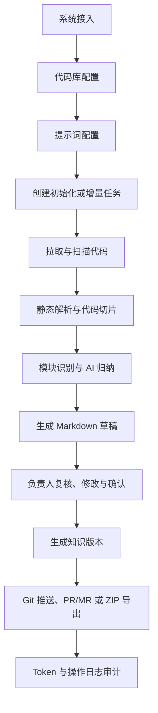

# 代码洞察平台（CodeInsight Platform）

代码洞察平台面向研发团队，将现有代码库持续转化为可维护、可追溯、可复核的代码知识资产。平台串联代码拉取、Java 静态解析、代码切片、AI 归纳、草稿复核、知识版本、Git/ZIP 输出、Token 审计和操作日志，确保 AI 内容先审后发，不直接进入正式知识库。

- 前端：React 19 + TypeScript + Vite + Ant Design + Zustand + ECharts + Monaco Editor
- 后端：Java 17 + Spring Boot 3.3 + MyBatis Plus + PostgreSQL + Redis + JGit
- 存储边界：数据库保存状态和元数据，本地存储/对象存储保存正文，Redis 保存临时编辑与锁，Git 保存已确认知识

## 当前状态与验证

第一阶段 MVP 任务清单已完成，覆盖系统、仓库、提示词、任务、扫描解析、切片、AI/Mock AI、草稿、知识版本、推送、Token 与日志模块。最新前端视觉方案已完成桌面端、移动端、弹窗和导航状态对照验收。

截至 2026-06-21 的可复现验证结果：

| 验证项 | 结果 | 说明 |
| --- | --- | --- |
| `npm.cmd run lint` | 通过 | ESLint 无错误 |
| `npm.cmd run build` | 通过 | Vite 构建成功；存在主包超过 500 kB 的非阻断告警 |
| `java -version` | 通过 | Java 17.0.17 |
| `mvn.cmd test` | 通过 | 23 个测试，0 失败、0 错误、0 跳过 |
| `mvn.cmd clean package` | 本轮未复验 | 运行中的后端 JAR 被 Windows 锁定，`clean` 无法删除旧产物 |

这里的“完成”指 MVP 功能和本地验收基线完成，并不等于生产环境开箱即用。生产部署前仍需补齐身份认证与授权、密钥托管、真实模型服务、远程 Git 权限、基础设施运维配置和前端代码分包。

## 核心业务闭环



AI 只负责归纳和建议。模块 ID、类路径绑定、Schema 校验、状态推进、存储、版本与推送校验由程序负责；正式知识必须经过负责人确认。

## 核心能力

- 工作台：任务吞吐、待复核、Token 成本、知识覆盖率、异常提醒与最近推送。
- 系统与仓库：系统负责人、启停、仓库分支、扫描范围、排除规则和 Commit 基线。
- 提示词：模板、版本、复制、启停、变量替换和试跑。
- 任务引擎：初始化/增量任务、状态机、进度、重试、终止和执行日志。
- 扫描解析：JGit 拉取、文件快照、Java 类型/路由/方法/异常/表与基础调用关系解析。
- 切片与 AI：文件、类、方法和 Diff 切片，Token 预估、额度阻断、Mock/真实模型适配。
- 草稿复核：三栏编辑区、来源行号、待确认项、修订记录、意见、自动保存和编辑锁。
- 知识输出：版本元数据、标准概述文件、推送前校验、Git 提交和 ZIP 导出。
- 审计：Token 明细与趋势、额度策略、操作日志和异常追踪。

## 快速开始

### 环境要求

- JDK 17
- Maven 3.8+
- Node.js 20+
- PostgreSQL 14+
- Redis 6+（自动保存与编辑锁）

未配置真实模型时，后端默认启用 Mock AI。

### 1. 准备数据库

```bash
createdb -U postgres code_insight
```

后端启动时会读取 `backend/src/main/resources/db/schema.sql` 初始化表结构。

### 2. 启动后端

```bash
cd backend
mvn spring-boot:run
```

### 3. 启动前端

```bash
cd frontend
npm install
npm run dev
```

默认地址：

- 前端：`http://localhost:5173`
- 后端 API：`http://localhost:8080/api`
- Swagger UI：`http://localhost:8080/api/swagger-ui.html`

## 配置

环境变量示例见根目录 `.env.example`。不要把真实密码、Token 或模型密钥提交到配置文件。

| 变量 | 默认值 | 用途 |
| --- | --- | --- |
| `SERVER_PORT` | `8080` | 后端端口 |
| `DB_HOST` / `DB_PORT` | `localhost` / `5432` | PostgreSQL 地址 |
| `DB_NAME` / `DB_USER` | `code_insight` / `postgres` | 数据库与用户 |
| `DB_PASSWORD` | `postgres` | 本地默认密码，生产环境必须覆盖 |
| `REDIS_HOST` / `REDIS_PORT` | `localhost` / `6379` | Redis 地址 |
| `STORAGE_LOCAL_PATH` | `./storage` | MVP 本地正文存储目录 |
| `LLM_MOCK` | `true` | 是否启用本地 Mock AI |
| `LLM_API_KEY` | 空 | 真实模型服务密钥 |
| `LLM_API_URL` / `LLM_MODEL_NAME` | 见 `.env.example` | 模型服务地址与模型名 |
| `VITE_API_BASE_URL` | `/api` | 前端 API 基础路径 |

## 开发与验证

前端：

```bash
cd frontend
npm install
npm run lint
npm run build
npm run dev
```

后端：

```bash
cd backend
java -version
mvn clean test
mvn clean package
mvn spring-boot:run
```

后端统一响应：

```json
{
  "code": 0,
  "message": "success",
  "data": {}
}
```

## 项目结构

```text
CodeInsight/
+-- backend/
|   +-- pom.xml
|   +-- src/main/java/com/company/codeinsight/
|   |   +-- common/
|   |   +-- modules/
|   |   |   +-- system/ repository/ prompt/ task/
|   |   |   +-- scanner/ parser/ chunk/ ai/
|   |   |   +-- draft/ knowledge/ push/ token/ log/
|   |   +-- worker/
|   +-- src/main/resources/
|       +-- application.yml
|       +-- application-local.yml
|       +-- db/schema.sql
+-- frontend/
|   +-- package.json
|   +-- vite.config.ts
|   +-- src/
|       +-- api/ components/ layouts/ pages/
|       +-- router/ stores/ types/ utils/
+-- docs/
|   +-- PRD.md
|   +-- TASKS.md
|   +-- ACCEPTANCE.md
|   +-- PROGRESS.md
|   +-- DECISIONS.md
|   +-- BLOCKERS.md
+-- .env.example
+-- README.md
```

## 任务状态机

```text
DRAFT -> PENDING -> PULLING_CODE -> PARSING_CODE -> SPLITTING_TASK
      -> AI_ANALYZING -> GENERATING_DOC -> PENDING_REVIEW -> REVIEWING
      -> CONFIRMED -> PUSHING -> PUSHED
```

异常与终止状态：`FAILED`、`CANCELLED`、`ARCHIVED`。状态变化必须写入日志，不允许非法跳转。

## 知识输出目录

负责人确认后，平台在目标仓库生成：

```text
/docs/code-insight
  index.md
  module-index.md
  architecture-overview.md
  frontend-overview.md
  backend-overview.md
  api-index.md
  database-index.md
  dependency-index.md
  pending-confirmation.md
  /modules
  /changes
  /meta
```

元数据包括 `knowledge-version.json`、`module-map.yaml` 和 `prompt-used.json`。


## 已知限制

- 前端生产主包约 2.48 MB（gzip 约 802 kB），Vite 会报告 chunk size warning；后续应对 ECharts、Monaco 和路由页面做按需加载与分包。
- `SecurityConfig` 当前允许所有请求，仅适合本地 MVP 联调，不可直接作为生产权限方案。
- Mock AI 能验证流程和数据落库，真实模型质量、配额和失败恢复仍需在目标环境验证。
- Git 推送测试可在无 `.git` 环境下降级为 Mock；生产交付前必须用真实远程仓库和最小权限凭证复验。
- PostgreSQL、Redis、外部模型与远程 Git 的可用性属于运行环境前置条件；阻塞历史见 `docs/BLOCKERS.md`。
- 部分历史中文文档在非 UTF-8 终端下可能显示乱码，应显式使用 UTF-8 读取。
- 2026-06-21 配置清理前生成的旧构建产物不得分发；应先吊销旧模型密钥、停止旧服务并重新执行 `mvn clean package`。

## 后续演进

1. 完成生产级认证、授权、审计身份绑定和密钥托管。
2. 配置真实模型与远程 Git 仓库，执行带权限、配额和失败恢复的端到端验收。
3. 拆分前端大包，清理 Ant Design 旧组件弃用提示。
4. 基于现有 class-dependencies / method-calls 数据扩展调用链、影响分析和代码图谱。
